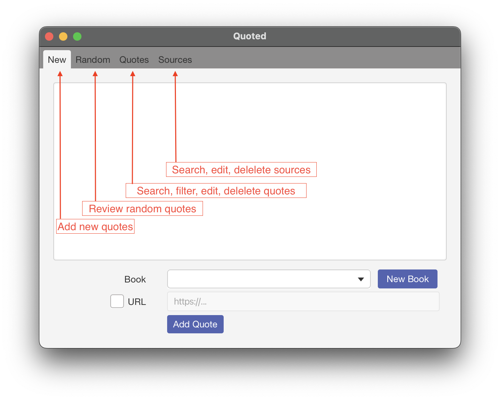
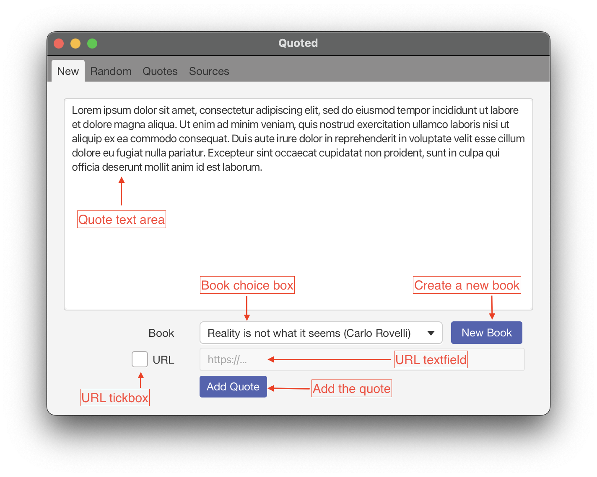
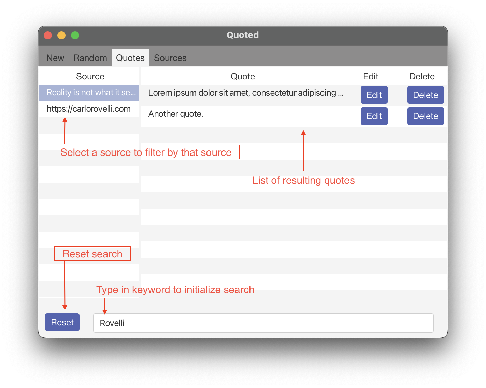
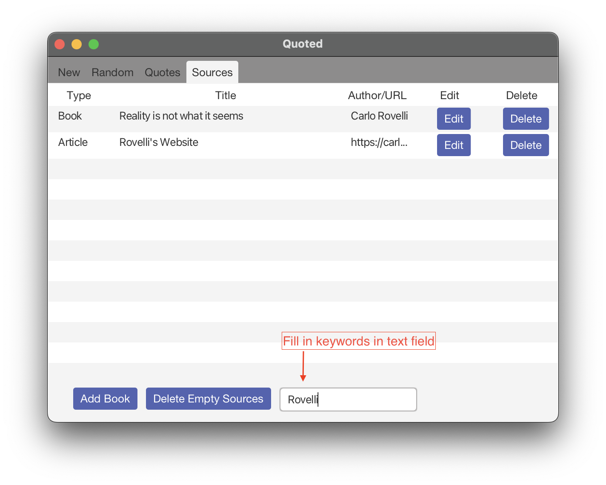
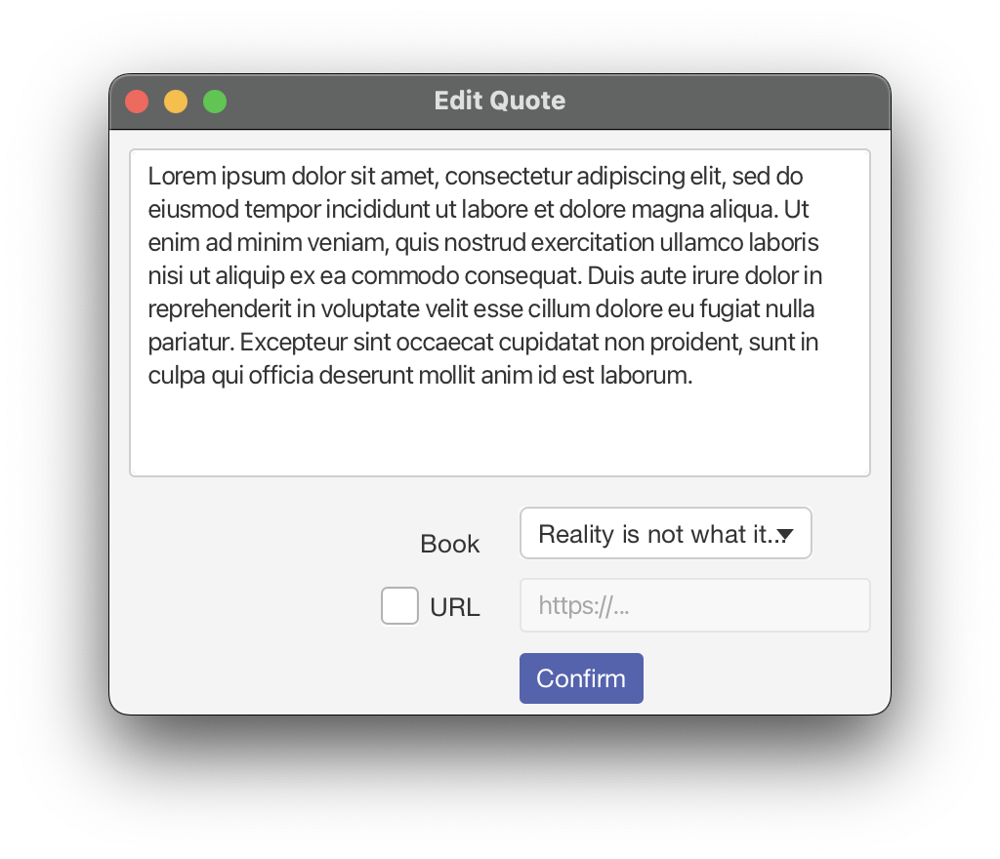
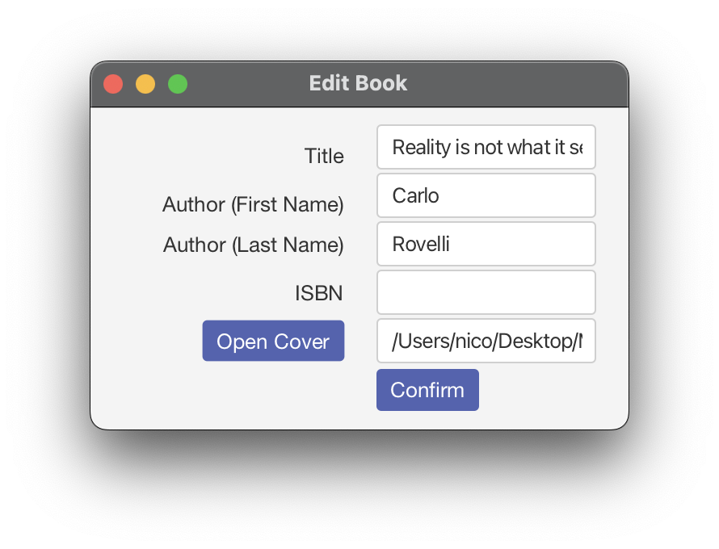
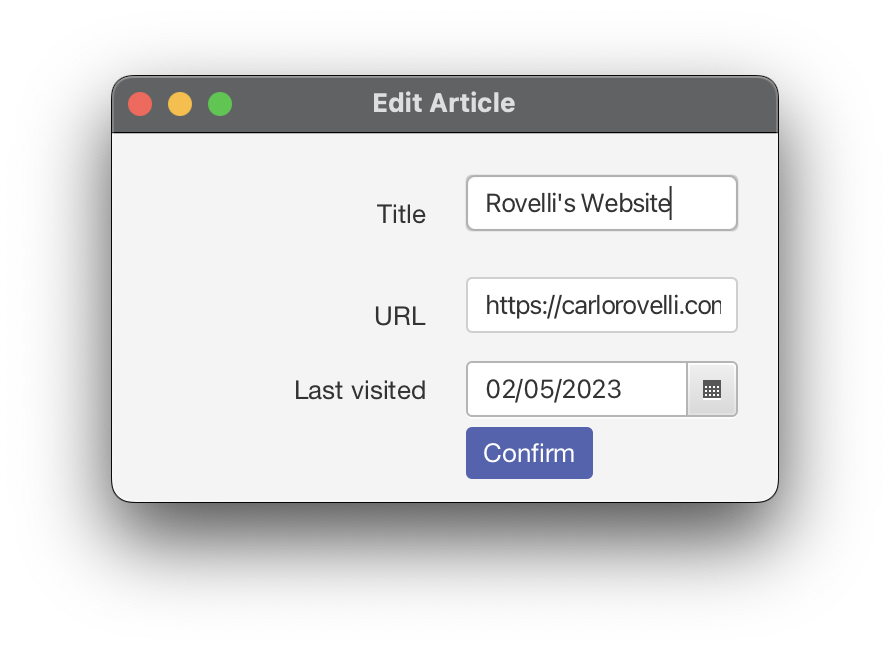

# Quoted User Manual

## Table of Contents
- [Introduction](#introduction)
- [Features](#features)
- [General Application Usage](#general-application-usage)
- [Adding Quotes](#adding-quotes)
- [Reviewing Random Quotes](#editing-quotes)
- [Searching Quotes](#searching-quotes)
- [Adding Sources](#adding-sources)
- [Searching Sources](#searching-sources)
- [Editing and Deleting Quotes](#editing-quotes)
- [Editing and Deleting Sources](#editing-sources)
- [Closing the Application](#closing-the-application)

## Introduction

Quoted is a simple quote management app. It allows you to create, edit, delete and view quotes and their respective sources and persist them in a database. You can also review random quotes and search quotes and sources by keyword.

This user manual will make use of screenshots of the application. Red boxes/annotations will be used to highlight the relevant parts of the application.

## Features

- Create, edit, delete and view quotes
- Review random quotes
- Create, edit, delete and view sources (Books or Websites)
- Search quotes and by keyword or source, search sources by keyword

### Addional Features

- Deleting a source will also delete all quotes by that source.
- Adding a quote to a website will automatically update the respective 'Last Visit' date of the website.
- Books, Websites/Articles and authors will be automatically merged if they are identical, i.e. if they have the same title, author or URL. This is case-insensitive.

### Non-Functional Features
- The application has been tested with up to 1000 quotes and 1000 sources on a 2021 M1 Pro MacBook.

## General Application Usage

When you start the application, you will see the main window. You can navigate to the different features using the tabs in the top left corner.

## Adding Quotes

To add a quote, fill or copy/paste into the main text field.

To add a source to the quote (mandatory) either select an existing book from the choicebox, create a new book via the respective button, or fill in the the URL text field after checking the URL checkbox.

The quote will be saved to the server-side database when you click the "Add Quote" button you will briefly see a success message. If any input was invalid, you will see a respective error message.

## Reviewing Random Quotes

To review a random quote, select the "Random" tab. You will see a random quote and its source (if quotes are present in the server-side database). You can click the "Next" button to see another random quote.

## Searching Quotes

To search quotes, select the "Quotes" tab. You can search by keyword or source.

You can also combine both search options, i.e. search for a source and then view all quotes by that source.

To search by keywords, fill in the search text field and results will be filtered automatically. The keyword search will filter quotes by their text but also there sources, i.e. book or article titles, URLs or authors.

To filter by source, select a source from the left table.

The right table will show the results of filtering/searching.

To reset the search/filter, click the "Reset" button.

You can use all this functionality before editing/deleting quotes.

## Adding Sources

If the source of a quote is a Website, it will be automatically added to the server-side database when you add the quote and paste/fill in the URL, if not yet present.

To add a book, select the "Sources" tab and click the "Add Book" button. Fill in the respective fields and click the "Add Book" button to add a book, or press the respective button already described in the "New" tab.

You can see the respective form window in the Editing and Deleting Sources section.

## Searching Sources

To search sources, select the "Sources" tab. You can search by keyword, and the table will be automatically filtered.

To reset the search/filter, simply delete the search text.

You can use this functionality before editing/deleting sources.

## Editing and Deleting Quotes

To edit or delete a quote, select the "Quotes" tab. You can search for the quote you want to edit/delete using the search functionality described in the Searching Quotes section.

### Deleting Quotes
To delete a quote, click the "Delete" button in the row of the respective quote. The quote will be deleted from the server.

### Editing Quotes
To edit a quote, select the quote in the right table and click the "Edit" button. The following window allows you to edit the quote text and source. Press "Confirm" to save the changes.

## Editing and Deleting Sources

To edit or delete a source, select the "Sources" tab. You can search for the source you want to edit/delete using the search functionality described in the [Searching Sources](#searching-sources) section.

### Deleting Sources
To delete a source, click the "Delete" button in the row of the respective source. The source will be deleted from the server.

⚠️ If you delete a source, all quotes that have this source will be deleted as well.

To delete all 'empty' sources, i.e. sources that are not associated with any quotes, click the "Delete Empty Sources" button.

### Editing Sources
To edit a source, select the source in the right table and click the "Edit" button. The following window allows you to edit the source, depending on which the quote is a Website or a Book. Press "Confirm" to save the changes.

For books, you can edit the title, author and (optionally) the ISBN and cover picture path. If available, the cover picture will be displayed in the form window.

If any input was invalid, you will see a respective error message (e.g. ISBNs must consist of either 10 or 13 digits plus optional dashes, and the cover picture path must be a valid path to an image file)

(Photo by <a href="https://unsplash.com/@thelondoner?utm_source=unsplash&utm_medium=referral&utm_content=creditCopyText">Tim Alex</a> on <a href="https://unsplash.com/photos/xG5VJW-7Bio?utm_source=unsplash&utm_medium=referral&utm_content=creditCopyText">Unsplash</a>)

ℹ️The cover picture path is optional and will not be used by the application. It is currently only for your reference, and will be used in a future version of the application to support export functionality.

For websites, you can edit the URL, the title, and the date of the last visit.

## Closing the Application

To exit the application, simply close the main window.

